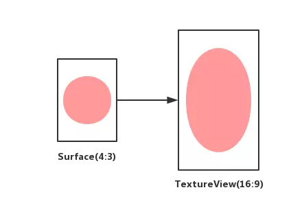
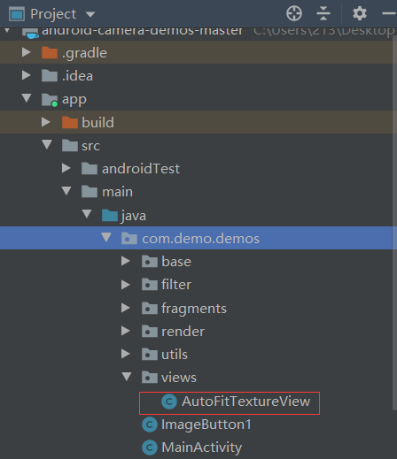
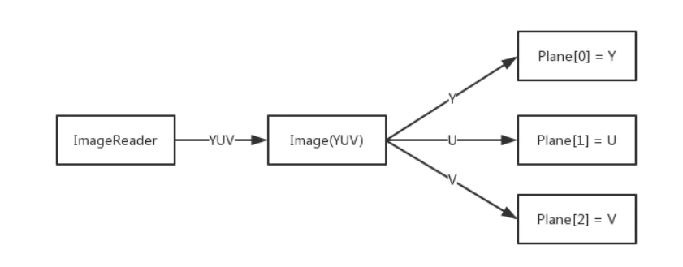
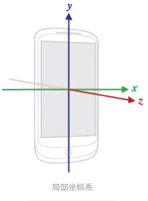
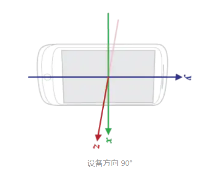
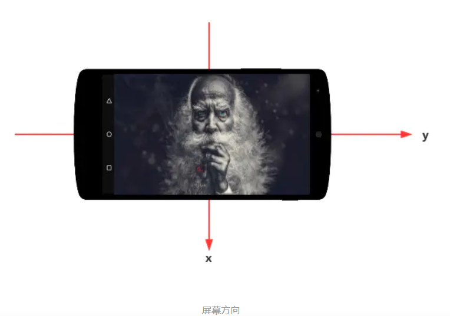
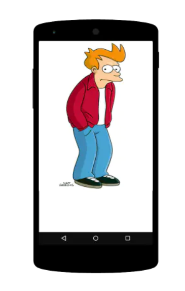
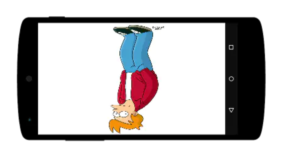
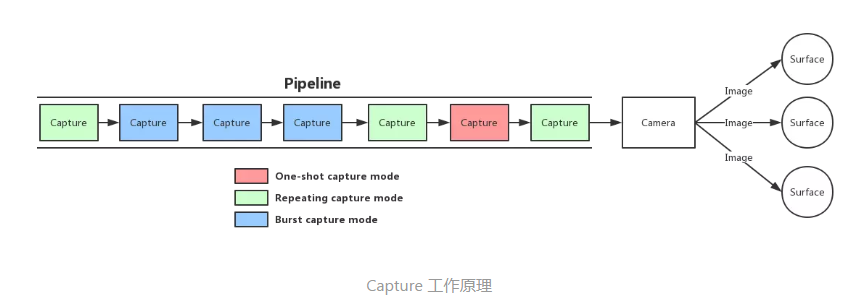

# Camera - docs/basic 

​	从 Android 5.0 开始，Google 引入了一套全新的相机框架 Camera2，旧的被废弃，本项目主要为Camera2 的重要概念和使用方法的说明文档。

## 相机的使用

#### **2.1**     **在项目中运用相机的方法**

##### 1)   权限注册

​	在使用相机 API 之前，必须在 AndroidManifest.xml 注册相机权限 android.permission.CAMERA，声明我们开发的应用程序需要相机权限。由于我们还需要保存照片，因此还需申明读写 SD 卡的权限，权限注册代码如下：

```
    <uses-permission android:name="android.permission.READ_EXTERNAL_STORAGE"/>
    <uses-permission android:name="android.permission.WRITE_EXTERNAL_STORAGE"/>
    <uses-permission android:name="android.permission.CAMERA" />
```

​	需要注意的是，在安卓6.0以前，我们只需要注册即可获得权限，而在安卓6.0以后的版本中，对于部分安全权限只要注册就由系统直接分配权限，而对于部分危险权限（如摄像机、内存读写）则需要在程序运行过程中动态进行权限申请，当一个必要的权限被用户禁止时，我们就弹窗提示用户程序因为权限被拒绝而无法正常工作。动态申请的这部分代码被我们封装在了一个集成自AppCompatActivity的自定义类BaseActivity中，我们将在后续的部分详细的讲解如何进行动态权限的申请。

##### 2)   配置相机特性要求

​	除了申请必要的权限，我们在项目中还需要在AndroidManifest.xml中配置特定的特性需求。这样，如果用户的手机对我们所需的特性不支持，则用户在安装apk的时候就会因条件不足而无法安装。在我们的demo中申请了相机特性和自动对焦特性，这意味着只用用户手机拥有可自动对焦的相机才可使用我们的demo。特性申请的代码如下：

```
    <uses-feature android:name="android.hardware.camera" />
    <uses-feature android:name="android.hardware.camera.autofocus" />
```

​	如果你需要其他的权限，可以去官方文档查询（该网址似乎需要梯子）：

<https://developer.android.com/guide/topics/manifest/uses-feature-element.html#hw-features>

##### 3)   获取 CameraManager 实例

​	正如之前所说，CameraManager 是一个负责查询和建立相机连接的系统服务，是 Camera2 使用流程的起点，因此我们首先需要通过getSystemService()方法获取CameraManager实例。其代码如下：

```
    private static Context appContext;
    private static CameraManager cameraManager;
    public static void init(Context context){
        if (appContext == null) {
            appContext = context.getApplicationContext();
            cameraManager=(CameraManager) appContext.getSystemService(Context.CAMERA_SERVICE);
        }
    }
```

​	在实际运用中我们封装了一个工具类CameraUtils去定义了一些相机使用中的基本操作，后面我们会详细的介绍这个类，这里我们只需要了解如何获取CameraManager实例。

##### 4)   获取相机 ID 列表

​	现在的手机一般包括一个前置摄像头呵多个后置摄像头，因此我们需要通过CameraManager.getCameraIdList()方法去获取所有可用的相机ID列表，如果想使用前置相机，则需要利用相机配置信息中的相机朝向进行筛选。

##### 5)   根据相机 ID 获取 CameraCharacteristics

​	CameraCharacteristics 是相机信息的提供者，通过它我们可以获取所有相机信息。我们需要调用CameraManager.getCameraCharacteristics()方法去获取相机的信息，同时借用这部分信息去筛选我们所需要的摄像头。对于CameraCharacteristics，我们可以通过该类的get方法去获取我们需要的信息，其内部传入的参数即是我们想要得到的数据，具体参数列表可在前文给出的官方文档网址链接中插叙。在我们的demo中，为了实现前置摄像头和后置摄像头的切换，我们在工具类CameraUtils中封装了对摄像头的获取，其代码如下：

```
    public String getCameraId(boolean useFront){
        try {
            for (String cameraId : cameraManager.getCameraIdList()){
                CameraCharacteristics characteristics = cameraManager.getCameraCharacteristics(cameraId);
                int cameraFacing = characteristics.get(CameraCharacteristics.LENS_FACING);
                if (useFront){
                    if (cameraFacing == CameraCharacteristics.LENS_FACING_FRONT){
                        return cameraId;
                    }
                }else {
                    if (cameraFacing == CameraCharacteristics.LENS_FACING_BACK){
                        return cameraId;
                    }
                }
            }
        } catch (CameraAccessException e) {
            e.printStackTrace();
        }
        return null;
    }
```

​	在上述代码中，我们传入了一个bool类型的参数用于筛选前置和后置摄像头，true为使用前置，false为使用后置摄像头。然后我们通过cameraManager.getCameraIdList()方法获取所有的摄像头id列表，遍历列表并以摄像头id为参数调用cameraManager.getCameraCharacteristics，从而获取对应摄像头的信息，然后通过characteristics.get(CameraCharacteristics.LENS_FACING)方法获取相机的朝向，LENS_FACING_FRONT表示前置，LENS_FACING_BACK表示后置，LENS_FACING_EXTERNAL表示外置摄像头。

​	实际上，为了保证代码的稳定性，我们还需要通过CameraCharacteristics.INFO_SUPPORTED_HARDWARE_LEVEL判断摄像头是否达到了支持我们所使用的特性，项目中为了简化问题以及考虑到我们使用的手机基本都能保证要求而忽略了这部分的判定。

##### 6)   开启相机

​	接下来我们要做的就是调用 CameraManager.openCamera() 方法开启相机了，该方法要求我们传递两个参数，一个是相机 ID，一个是监听相机状态的 CameraStateCallback。当相机被成功开启的时候会通过 CameraStateCallback.onOpened() 方法回调一个 CameraDevice 实例给你，否则的话会通过 CameraStateCallback.onError() 方法回调一个 CameraDevice 实例和一个错误码给你。onOpened() 和 onError() 其实都意味着相机已经被开启了，唯一的区别是 onError() 表示开启过程中出了问题，你必须把传递给你的 CameraDevice 关闭，而不是继续使用它。当然，在使用相机前我们需要保证在开启相机之前已经被授予了相机权限，比较保险的方法是每次开启相机之前都检查一遍权限。我们的demo在onResume周期中进行权限的判断，如果通过权限则调用打开摄像头的经封装openCamera方法。以下是打开摄像头部分的代码：

```
	@SuppressLint("MissingPermission")
    private void openCamera() {
        try {
            //打开相机
            cameraManager.openCamera(cameraId,
                    new CameraDevice.StateCallback() {
                        @Override
                        public void onOpened(CameraDevice camera) {
                            if (camera == null) {
                                return;
                            }
                            cameraDevice = camera;
                            //创建相机预览 session
                            createPreviewSession();
                        }

                        @Override
                        public void onDisconnected(CameraDevice camera) {
                            //释放相机资源
                            releaseCamera();
                        }

                        @Override
                        public void onError(CameraDevice camera, int error) {
                            //释放相机资源
                            releaseCamera();
                        }
                    },
                    null);
        } catch (CameraAccessException e) {
            e.printStackTrace();
        }
    }
```

##### 7)   关闭相机

​	当我们不再需要使用相机时应调用 CameraDevice.close() 方法及时关闭相机回收资源。关闭相机的操作至关重要，如果一直占用相机资源，其他基于相机开发的功能都会无法正常使用，严重情况下直接导致其他相机相关的 APP 无法正常使用。因此，为了保证其他app功能的正常使用，我们最好在在onPouse的时候释放相机资源。释放相机资源代码如下：

```
    private void releaseCamera() {
        CameraUtils.getInstance().releaseImageReader(previewReader);
        CameraUtils.getInstance().releaseCameraSession(cameraCaptureSession);
        CameraUtils.getInstance().releaseCameraDevice(cameraDevice);
    }
```

```
	//CameraUtlis 
    public void releaseCameraDevice(CameraDevice cameraDevice){
        if (cameraDevice != null){
            cameraDevice.close();
            cameraDevice = null;
        }
    }
    public void releaseCameraSession(CameraCaptureSession session){
        if (session != null){
            session.close();
            session = null;
        }
    }
    public void releaseImageReader(ImageReader reader){
        if (reader != null){
            reader.close();
            reader = null;
        }
    }
```

​	在上述的代码中，我们将释放相机资源的方法封装成了函数，而实际上释放的方法定义在工具类CameraUltis中。在释放相机资源的同时，我们也需要释放相机会话和ImageReader的资源，关于ImageReader的内容我们会在接下来的部分中提到。

#### **2.2**     **设置相机预览界面**

##### 1)   获取预览尺寸

​	前面我们提到过CameraCharacteristics 是一个只读的相机信息提供者，其内部携带大量的相机信息，其中包括我们获取预览尺寸所需的SCALER_STREAM_CONFIGURATION_MAP。但是，这个流配置并不是我们最终需要的信息，我们需要通过StreamConfigurationMap类对它进行一定的转换，具体代码如下所示：

```
    CameraCharacteristics characteristics = cameraManager.getCameraCharacteristics(cameraId);
    StreamConfigurationMap configs = characteristics.get(CameraCharacteristics.SCALER_STREAM_CONFIGURATION_MAP);
    List<Size> sizes = Arrays.asList(configs.getOutputSizes(clz));
```

​	在上述代码中，我们通过相机id获取其相应的信息，然后筛选出流配置信息，最后通过StreamConfigurationMap实例调用getOutputSizes获取输出尺寸。需要注意的是，getOutputSizes可以传入两种参数，一种是int形的format参数（可在官方文档中查询Imageformat和PixelFormat查询对应参数，选择自己所需的格式），表示特定格式的输出尺寸，另一种是一个类，可以获得和类兼容的输出尺寸。如果传入的格式是不被支持的，则会返回null。为了区别这两种使用方法，并且对输出尺寸进行处理我们在工具类CameraUlits中封装了两个函数去分别处理两种类型，具体代码我们会在后面的demo分析中进行演示与讲解。

​	当然，在实际运用中，我们往往采用传入类的方式去获取输出列表，例如我们在demo中传入SurfaceTexture.class去获取SurfaceTexture类的输出尺寸，利用ImageReader来获取拍照数据或接收YUV数据。此外，还有经常用于录制视频的MediaRecorder类和MediaCodec类，以及另一个常被用于预览的SurfaceHolder。

​	获得预览尺寸后并不代表事情的结束，我们还需要根据需求去对预览尺寸进行处理，最终获取我们需要的尺寸。我们在常见的相机软件中遇到的比例切换就是通过切换预览尺寸，更新界面实现的。

##### 2)   配置尺寸与适配预览比例

​	当我们获得合适的尺寸之后就需要配置尺寸了，在Camera2中，我们需要把所有的信息都设置给一个Surface类的实例，例如接收预览画面的 SurfaceTexture，或者是接收拍照图片的 ImageReader，相机在输出图像数据的时候会根据 Surface 配置的 Buffer 大小输出对应尺寸的画面。

​	获取 Surface 的方式有很多种，可以通过 TextureView、SurfaceView、ImageReader 甚至是通过 OpenGL （在GL部分会详细讲解）创建，这里我们要将预览画面显示在屏幕上，所以我们选择了 TextureView。当然，在实际项目中我们不只是简单的使用TextureView，因为一旦预览尺寸和我们现实预览信息所使用的TextureView宽高比不同的时候，预览图像会发生拉伸的现象，例如我们使用4:3的图片去填充一个16:9的TextureView。



​	因此，我们专门封装了一个继承自TextureView的子类AutoFitTextureView，从而实现通过预览尺寸调整AutoFitTextureView的宽高比，防止图片拉伸的功能。我们暂时只需要知道这个类的用法，一会儿我们会详细讲解这个类的实现以及使用。此外，我们还需要知道，由于在android中相机 Sensor（传感器）的宽是长边，而高是短边，因此事实上我们得到的预览尺寸中宽是比高要大的，所以在调整宽高比的时候需要注意将宽高互换。

​	话题回归尺寸的配置，为了显示我们的预览画面，我们需要利用AutoFitTextureView的全路径在布局中设置中添加一个AutoFitTextureView。路径的查询可通过调整AS的文件显示为Project，查看java文件夹下类的路径，如下图所示：



​	因此，AutoFitTextureView类的全路径为com.demo.demos.views.AutoFitTextureView。

​	之后，我们需要在对应的Activity里获取AutoFitTextureView对象，并添加一个监听器TextureView.SurfaceTextureListener用于监听AutoFitTextureView的状态。当AutoFitTextureView的实例可用时会回调onSurfaceTextureAvailable，我们需要在这个方法下面通过SurfaceTexture.setDefaultBufferSize()设置预览画面的尺寸并创建surface对象。然后，我们需要通过AutoFitTextureView中封装的设置宽高比方法setAspectRation去设定宽高比，然后调用requestLayout方法请求重新布局。这样，系统就会调用我们重写过的onMeasure方法去重新设置布局，我们需要在改方法中调用setMeasuredDimension方法去改变实际的宽和高。setAspectRation和setMeasuredDimension代码如下：

```
	public void setAspectRation(int width, int height){
        if (width < 0 || height < 0){
            throw new IllegalArgumentException("width or height can not be negative.");
        }
        ratioW = width;
        ratioH = height;
        //请求重新布局
        requestLayout();
    }

    @Override
    protected void onMeasure(int widthMeasureSpec, int heightMeasureSpec) {
        super.onMeasure(widthMeasureSpec, heightMeasureSpec);
        int width = MeasureSpec.getSize(widthMeasureSpec);
        int height = MeasureSpec.getSize(heightMeasureSpec);

        if (0 == ratioW || 0 == ratioH){
            //未设定宽高比，使用预览窗口默认宽高
            setMeasuredDimension(width, height);
        }else {
            //设定宽高比，调整预览窗口大小（调整后窗口大小不超过默认值）
            if (width < height * ratioW / ratioH){
                setMeasuredDimension(width, width * ratioH / ratioW);
            }else {
                setMeasuredDimension(height * ratioW / ratioH, height);
            }
        }
    }
```

​	在我们的demo中，onSurfaceTextureAvailable回调函数中会调用自定义的openCamera函数，并且在相机存在的情况下调用重新创建相机会话和相机预览函数createPreviewSession，实际的设置尺寸的操作也被封装在createPreviewSession里面，我们在后面的demo中会详细讲述这个函数的内容。

##### 3)   创建 CameraCaptureSession

​	用于接收预览画面的 Surface 准备就绪了，接了下来我们要使用这个 Surface 创建一个 CameraCaptureSession 实例，涉及的方法是 CameraDevice.createCaptureSession()，该方法要求你传递以下三个参数：

l  outputs：所有用于接收图像数据的 Surface，例如本章用于接收预览画面的 Surface，后续还会有用于拍照的 Surface，这些 Surface 必须在创建 Session 之前就准备好，并且在创建 Session 的时候传递给底层用于配置 Pipeline。

l  callback：用于监听 Session 状态的 CameraCaptureSession.StateCallback 对象，就如同开关相机一样，创建和销毁 Session 也需要我们注册一个状态监听器。

l  handler：用于执行 CameraCaptureSession.StateCallback 的 Handler 对象，可以是异步线程的 Handler，也可以是主线程的 Handler，在我们的 Demo 里使用的是null。

##### 4)   创建 CaptureRequest

​	CaptureRequest是我们执行任何相机操作都绕不开的核心类，因为它是向 CameraCaptureSession 提交 Capture 请求时的信息载体，其内部包括了本次 Capture 的参数配置和接收图像数据的 Surface。

​	CaptureRequest 可以配置的信息非常多，包括图像格式、图像分辨率、传感器控制、闪光灯控制、3A 控制等等，可以说绝大部分的相机参数都是通过 CaptureRequest 配置的。我们可以通过 CameraDevice.createCaptureRequest() 方法创建一个 CaptureRequest.Builder 对象，该方法只有一个参数 templateType 用于指定使用何种模板创建 CaptureRequest.Builder 对象。考虑到CaptureRequest 可以配置的参数实在是太多了，如果每一个参数都要我们手动去配置，是十分复杂而且费力的，所以 Camera2 根据使用场景的不同，为我们事先配置好了一些常用的参数模板：

l  TEMPLATE_PREVIEW：适用于配置预览的模板。

l  TEMPLATE_RECORD：适用于视频录制的模板。

l  TEMPLATE_STILL_CAPTURE：适用于拍照的模板。

l  TEMPLATE_VIDEO_SNAPSHOT：适用于在录制视频过程中支持拍照的模板。

l  TEMPLATE_MANUAL：适用于希望自己手动配置大部分参数的模板。

​	一个 CaptureRequest 除了需要配置很多参数之外，还要求至少配置一个 Surface（任何相机操作的本质都是为了捕获图像），并且配置的 Surface 必须属于创建 Session 时添加的那些 Surface，涉及的方法是 CaptureRequest.Builder.addTarget()，你可以多次调用该方法添加多个 Surface。

​	最后，我们通过 CaptureRequest.Builder.build() 方法创建出一个只读的 CaptureRequest 实例。整个过程的代码如下：

```
    CaptureRequest.Builder builder = cameraDevice.createCaptureRequest(CameraDevice.TEMPLATE_PREVIEW);
    builder.addTarget(previewSurface);//设置 previewSurface 作为预览数据的显示界面
    CaptureRequest captureRequest = builder.build();
```

##### 5)   开启和停止预览

​	在 Camera2 里，预览本质上是不断重复执行的 Capture 操作，每一次 Capture 都会把预览画面输出到对应的 Surface 上，涉及的方法是 CameraCaptureSession.setRepeatingRequest()，该方法有三个参数：

l  request：在不断重复执行 Capture 时使用的 CaptureRequest 对象。

l  callback：监听每一次 Capture 状态的 CameraCaptureSession.CaptureCallback 对象，例如 onCaptureStarted() 意味着一次 Capture 的开始，而 onCaptureCompleted() 意味着一次 Capture 的结束。

l  hander：用于执行 CameraCaptureSession.CaptureCallback 的 Handler 对象，可以是异步线程的 Handler，也可以是主线程的 Handler，在我们的 Demo 里使用的是null。

​	这部分具体的代码实现，我们会在接下来的获取预览数据中予以展示。

##### 6)   ImageReader

​	在 Camera2 里，ImageReader 是获取图像数据的一个重要途径，我们可以通过它获取各种各样格式的图像数据，例如 JPEG、YUV 和 RAW 等等。我们可以通过 ImageReader.newInstance() 方法创建一个 ImageReader 对象，该方法要求我们传递以下四个参数：

l  width：图像数据的宽度。

l  height：图像数据的高度。

l  format：图像数据的格式，定义在 ImageFormat 里，例如 ImageFormat.YUV_420_888。

l  maxImages：最大 Image 个数，可以理解成 Image 对象池的大小。

​	当有图像数据生成的时候，ImageReader 会通过通过 ImageReader.OnImageAvailableListener.onImageAvailable() 方法通知我们，然后我们可以调用 ImageReader.acquireNextImage() 方法获取存有最新数据的 Image 对象，而在 Image 对象里图像数据又根据不同格式被划分多个部分分别存储在单独的 Plane 对象里，我们可以通过调用 Image.getPlanes() 方法获取所有的 Plane 对象的数组，最后通过 Plane.getBuffer() 获取每一个 Plane 里存储的图像数据。以 YUV 数据为例，当有 YUV 数据生成的时候，数据会被分成 Y、U、V 三部分分别存储到 Plane 里，如下图所示：



##### 7)   获取预览数据

​	介绍完 ImageReader 之后，接下来我们就来创建一个接收每一帧预览数据的 ImageReader，数据格式为JPEG，对象池大小为2. 接着，我们使用前面已经确定好的预览尺寸创建一个 ImageReader，并且注册一个 ImageReader.OnImageAvailableListener 用于监听数据的更新，最后通过 ImageReader.getSurface() 方法获取接收预览数据的 Surface。

```
	previewReader = ImageReader.newInstance(previewSize.getWidth(), previewSize.getHeight(), ImageFormat.JPEG, 2);
	previewReader.setOnImageAvailableListener(
       new ImageReader.OnImageAvailableListener() {
        	@Override
            public void onImageAvailable(ImageReader reader) {
                Image image = reader.acquireLatestImage();
                if (image != null) {
                    ByteBuffer buffer = image.getPlanes()[0].getBuffer();
                    byte[] data = new byte[buffer.remaining()];
                    Log.d(TAG, "data-size=" + data.length);
                    buffer.get(data);
                	image.close();
        		}
   			}
    	},
    	null);
```

​	上述代码是我们demo中对ImageReader使用的代码，previewSize是我们最终的预览尺寸。需要注意的是在这段代码中image.close()十分重要当，我们不再需要使用某一个 Image 对象的时候记得通过该方法释放资源，因为 Image 对象实际上来自于一个创建 ImageReader 时就确定大小的对象池，如果我们不释放它的话就会导致对象池很快就被耗光，并且抛出一个异常。这也是我们在之前代码中提到的释放相机资源的同时释放ImageReader的原因。

​	创建完 ImageReader，并且获取它的 Surface 之后，我们就可以在创建 Session 的时候添加这个 Surface 告诉 Pipeline 我们有一个专门接收 JPEG 的 Surface。获取预览数据和显示预览画面一样都是不断重复执行的 Capture 操作，所以我们只需要在开始预览的时候通过 CaptureRequest.Builder.addTarget() 方法添加接收预览数据的 Surface 即可，所以一个 CaptureRequest会有两个 Surface，一个现实预览画面的 Surface（previewSurface），一个接收预览数据的 Surface（readerSurface）。

​	CameraCaptureSession的创建方式如下，

```
final Surface readerSurface = previewReader.getSurface();
cameraDevice.createCaptureSession(Arrays.asList(previewSurface, readerSurface),
new CameraCaptureSession.StateCallback() {
    @Override
    public void onConfigured(CameraCaptureSession session) {
        cameraCaptureSession = session;
        try {
            //构建预览捕获请求
            CaptureRequest.Builder builder = cameraDevice.createCaptureRequest(CameraDevice.TEMPLATE_PREVIEW);
            builder.addTarget(previewSurface);//设置 previewSurface 作为预览数据的显示界面
            builder.addTarget(readerSurface);
            CaptureRequest captureRequest = builder.build();
            //设置重复请求，以获取连续预览数据
            session.setRepeatingRequest(captureRequest, new CameraCaptureSession.CaptureCallback() {
                @Override
                public void onCaptureProgressed(CameraCaptureSession session, CaptureRequest request, CaptureResult partialResult) {
                    super.onCaptureProgressed(session, request, partialResult);
                }
                @Override
                public void onCaptureCompleted(CameraCaptureSession session, CaptureRequest request, TotalCaptureResult result) {
                    super.onCaptureCompleted(session, request, result);
                }
            },
            null);
        } catch (CameraAccessException e) {
            e.printStackTrace();
        }
    }
    @Override
    public void onConfigureFailed(CameraCaptureSession session) {

    }
},
null);

```

##### 8)   矫正图像数据的方向

​	在实际代码编写过程中，我们发现Camera2 不需要经过任何预览画面方向的矫正，就可以正确现实画面。其实，Camera2 也需要进行预览画面的矫正，只不过系统帮我们做了而已，当我们使用 TextureView 或者 SurfaceView 进行画面预览的时候，系统会根据【设备自然方向】、【摄像传感器方向】和【显示方向】自动矫正预览画面的方向，并且该矫正规则只适用于显示方向和和设备自然方向一致的情况下，举个例子，当我们把手机横放并且允许自动旋转屏幕的时候，看到的预览画面的方向就是错误的。此外，当我们使用一个 GLSurfaceView 显示预览画面或者使用 ImageReader 接收图像数据的时候，系统都不会进行画面的自动矫正，因为它不知道我们要如何显示预览画面，所以我们还是有必要学习下如何矫正图像数据的方向。在介绍如何矫正图像数据方向之前，我们需要先了解几个概念，它们分别是【设备自然方向】、【局部坐标系】、【显示方向】和【摄像头传感器方向】。

##### 9)   设备方向

​	当我们谈论方向的时候，实际上都是相对于某一个 0° 方向的角度，这个 0° 方向被称作自然方向，例如人站立的时候就是自然方向，你总不会认为一个人要倒立的时候才是自然方向吧，而接下来我们要谈论的设备方向就有的自然方向的定义。

​	设备方向指的是硬件设备在空间中的方向与其自然方向的顺时针夹角。这里提到的自然方向指的就是我们手持一个设备的时候最习惯的方向，比如手机我们习惯竖着拿，而平板我们则习惯横着拿，所以通常情况下手机的自然方向就是竖着的时候，平板的自然方向就是横着的时候。


​	以手机为例，我们可以有以下四个比较常见的设备方向：

l  当我们把手机垂直放置且屏幕朝向我们的时候，设备方向为 0°，即设备自然方向

l  当我们把手机向右横放且屏幕朝向我们的时候，设备方向为 90°

l  当我们把手机倒着放置且屏幕朝向我们的时候，设备方向为 180°

l  当我们把手机向左横放且屏幕朝向我们的时候，设备方向为 270°

​	了解了设备方向的概念之后，我们可以通过 OrientationEventListener 监听设备的方向，进而判断设备当前是否处于自然方向，当设备的方向发生变化的时候会回调 OrientationEventListener.onOrientationChanged(int) 方法，传给我们一个 0° 到 359° 的方向值，其中 0° 就代表设备处于自然方向。

##### 10) 局部坐标系

​	所谓的局部坐标系指的是当设备处于自然方向时，相对于设备屏幕的坐标系，该坐标系是固定不变的，不会因为设备方向的变化而改变，下图是基于手机的局部坐标系示意图：



l  x 轴是当手机处于自然方向时，和手机屏幕平行且指向右边的坐标轴。

l  y 轴是当手机处于自然方向时，和手机屏幕平行且指向上方的坐标轴。

l  z 轴是当手机处于自然方向时，和手机屏幕垂直且指向屏幕外面的坐标轴。

​	为了进一步解释【坐标系是固定不变的，不会因为设备方向的变化而改变】的概念，这里举个例子，当我们把手机向右横放且屏幕朝向我们的时候，此时设备方向为 90°，局部坐标系相对于手机屏幕是保持不变的，所以 y 轴正方向指向右边，x 轴正方向指向下方，z 轴正方向还是指向屏幕外面，如下图所示：



##### 11) 显示方向

​	显示方向指的是屏幕上显示画面与局部坐标系 y 轴的顺时针夹角。

​	为了更清楚的说明这个概念，我们举一个例子，假设我们将手机向右横放看电影，此时画面是朝上的，如下图所示：



​	从上图来看，手机向右横放会导致设备方向变成了 90°，但是显示方向却是 270°，因为它是相对局部坐标系 y 轴的顺时针夹角，所以跟设备方向没有任何关系。如果把图中的设备换成是平板，结果就不一样了，因为平板横放的时候就是它的设备自然方向，y 轴朝上，屏幕画面显示的方向和 y 轴的夹角是 0°，设备方向也是 0°。

​	总结一下，设备方向是相对于其现实空间中自然方向的角度，而显示方向是相对局部坐标系的角度。

##### 12) 摄像头传感器方向

​	摄像头传感器方向指的是传感器采集到的画面方向经过顺时针旋转多少度之后才能和局部坐标系的 y 轴正方向一致，也就是通过 CameraCharacteristics.SENSOR_ORIENTATION 获取到的值。

​	例如 orientation 为 90° 时，意味我们将摄像头采集到的画面顺时针旋转 90° 之后，画面的方向就和局部坐标系的 y 轴正方向一致，换个说法就是原始画面的方向和 y 轴的夹角是逆时针 90°。

​	最后我们要考虑一个特殊情况，就是前置摄像头的画面是做了镜像处理的，也就是所谓的前置镜像操作，这个情况下， orientation 的值并不是实际我们要旋转的角度，我们需要取它的镜像值才是我们真正要旋转的角度，例如 orientation 为 270°，实际我们要旋转的角度是 90°。

##### 13) 图像的矫正

​	介绍完几个方向的概念之后，我们就来说下如何校正相机的预览画面。我们会举几个例子，由简到繁逐步说明预览画面校正过程中要注意的事项。

​	首先我们要知道的是摄像头传感器方向只有 0°、90°、180°、270° 四个可选值，并且这些值是相对于局部坐标系 的 y 轴定义出来的，现在假设一个相机 APP 的画面在手机上是竖屏显示，也就是显示方向是 0° ，并且假设摄像头传感器的方向是 90°，如果我们没有校正画面的话，则显示的画面如下图所示（忽略画面变形）：


​	很明显，上面显示的画面内容方向是错误的，里面的人物应该是垂直向上显示才对，所以我们应该吧摄像头采集到的画面顺时针旋转 90°，才能得到正确的显示结果，如下图所示：



​	上面的例子是建立在我们的显示方向是 0° 的时候，如果我们要求显示方向是 90°，也就是手机向左横放的时候画面才是正的，并且假设摄像头传感器的方向还是 90°，如果我们没有校正画面的话，则显示的画面如下图所示（忽略画面变形）：



​	此时，我们知道传感器的方向是 90°，如果我们将传感器采集到的画面顺时针旋转 90° 显然是无法得到正确的画面，因为它是相对于局部坐标系 y 轴的角度，而不是实际显示方向，所以在做画面校正的时候我们还要把实际显示方向也考虑进去，这里实际显示方向是 90°，所以我们应该把传感器采集到的画面顺时针旋转 180°（摄像头传感器方向 + 实际显示方向） 才能得到正确的画面，显示的画面如下图所示（忽略画面变形）：


​	总结一下，在校正画面方向的时候要同时考虑两个因素，即摄像头传感器方向和显示方向。实际的代码部分为了简化，我们只在拍照部分做了图像的矫正，因此我们会在拍照部分讲解图像校正的代码。

#### **2.3**     **使用相机拍照**

##### 1)   Capture的工作流程

​	在介绍如何使用相机拍照之前，我们来回顾一下capture的工作流程。我们之前提到过，capture包含单次模式、多次模式和重复模式三种。。

​	我们举个例子来进一步说明上面三种模式，假设我们的相机应用程序开启了预览，所以会提交一个重复模式的 Capture 用于不断获取预览画面，然后我们提交一个单次模式的 Capture，接着我们又提交了一组连续三次的多次模式的 Capture，这些不同模式的 Capture 会按照下图所示被执行：



​	下面是几个重要的注意事项：

l  无论 Capture 以何种模式被提交，它们都是按顺序串行执行的，不存在并行执行的情况。

l  重复模式是一个比较特殊的模式，因为它会保留我们提交的 CaptureRequest 对象用于不断重复执行 Capture 操作，所以大多数情况下重复模式的 CaptureRequest 和其他模式的 CaptureRequest 是独立的，这就会导致重复模式的参数和其他模式的参数会有一定的差异，例如重复模式不会配置 CaptureRequest.AF_TRIGGER_START，因为这会导致相机不断触发对焦的操作。

l  如果某一次的 Capture 没有配置预览的 Surface，例如拍照的时候，就会导致本次 Capture 不会将画面输出到预览的 Surface 上，进而导致预览画面卡顿的情况，所以大部分情况下我们都会将预览的 Surface 添加到所有的 CaptureRequest 里。

##### 2)   矫正相机显示的方向

​	关于相机显示方向的矫正我们前面已经提过，这部分着重代码的解析。

```
	static {
       // 这里通过一定的设定方便旋转
        PHOTO_ORITATION.append(Surface.ROTATION_0, 90);
        PHOTO_ORITATION.append(Surface.ROTATION_90, 0);
        PHOTO_ORITATION.append(Surface.ROTATION_180, 270);
        PHOTO_ORITATION.append(Surface.ROTATION_270, 180);
	}
	displayRotation =
((Activity) getContext()).getWindowManager().getDefaultDisplay().getOrientation();
    if (displayRotation == Surface.ROTATION_0 || displayRotation == Surface.ROTATION_180) {
        previewView.setAspectRation(photoSize.getHeight(), photoSize.getWidth());
    } else {
        previewView.setAspectRation(photoSize.getWidth(), photoSize.getHeight());
    }
    configureTransform(previewView.getWidth(), previewView.getHeight());

```

```
	private void configureTransform(int viewWidth, int viewHeight) {
        Activity activity = getActivity();
        if (null == previewView || null == photoSize || null == activity) {
            return;
        }
        int rotation = activity.getWindowManager().getDefaultDisplay().getRotation();
        Matrix matrix = new Matrix();
        RectF viewRect = new RectF(0, 0, viewWidth, viewHeight);
        RectF bufferRect = new RectF(0, 0, photoSize.getHeight(), photoSize.getWidth());
        float centerX = viewRect.centerX();
        float centerY = viewRect.centerY();
        if (Surface.ROTATION_90 == rotation || Surface.ROTATION_270 == rotation) {
            bufferRect.offset(centerX - bufferRect.centerX(), centerY - bufferRect.centerY());
            matrix.setRectToRect(viewRect, bufferRect, Matrix.ScaleToFit.FILL);
            float scale = Math.max(
                (float) viewHeight / photoSize.getHeight(),
                (float) viewWidth / photoSize.getWidth());
            matrix.postScale(scale, scale, centerX, centerY);
            matrix.postRotate(90 * (rotation - 2), centerX, centerY);
        } else if (Surface.ROTATION_180 == rotation) {
            matrix.postRotate(180, centerX, centerY);
        }
        previewView.setTransform(matrix);
    }
```

​	在一开始我们设置好一个数组，给每个角度下设置相应的需旋转的角度。然后在启动相机时需要根据此时屏幕的显示方向（横屏/竖屏）调整预览窗口的大小和显示方向。

​	调整预览窗口的大小的方法，前文已经讲过，这里不做赘述。接下来，我们需要对预览窗口进行旋转，步骤如下：

l  调整预览方向：计算出预览窗口到相机输出窗口的变换矩阵。

l  先将两个窗口的中心平移到同一点；

l  设置两窗口缩放模式；

l  计算缩放比例和旋转角度；

l  最后需要将变换矩阵应用到预览窗口上。

##### 3)   拍摄单张照片

​	借由之前我们讲的Capture的工作原理我们可以推断出拍照的大致原理。首先，在我们按下拍照按钮前，需要使用连续模式的Capture去进行预览。一旦我们按下拍照键，就需要停止原本Capture的重复模式，然后执行单次的拍照capture。

​	在一开始，我们同样设置一个openCamera函数，并且在onResume周期和TextureView.SurfaceTextureListener的onSurfaceTextureAvailable回调方法中调用这个函数。在每次执行打开摄像头操作时，我们调整预览窗口的大小和显示方向。之后调用CameraManager.openCamera方法打开摄像头，在其回调函数cameraStateCallback中，我们要对相机进行初始化。在初始化操作中，我们要初始化拍照的ImageReader并获取其Surface。然后我们需要与预览模式一样设置好预览Surface，用拍照Surface和预览的Surface去创建CameraCaptureSession，同时在CameraCaptureSession的回调函数中执行captureSession.setRepeatingRequest反复刷新预览界面。

```
	@SuppressLint("MissingPermission")
    private void openCamera() {
        try {
            displayRotation = ((Activity) getContext()).getWindowManager().getDefaultDisplay().getOrientation();
            if (displayRotation == Surface.ROTATION_0 || displayRotation == Surface.ROTATION_180) {
                previewView.setAspectRation(photoSize.getHeight(), photoSize.getWidth());
            } else {
                previewView.setAspectRation(photoSize.getWidth(), photoSize.getHeight());
            }
            configureTransform(previewView.getWidth(), previewView.getHeight());
            cameraManager.openCamera(cameraId, cameraStateCallback, null);
        } catch (CameraAccessException e) {
            e.printStackTrace();
            Log.d(TAG, "相机访问异常");
        }
    }
```

```
	// cameraStateCallback回调方法
	CameraDevice.StateCallback cameraStateCallback = new CameraDevice.StateCallback() {
        @Override
        public void onOpened(CameraDevice camera) {
            Log.d(TAG, "相机已启动");
            //初始化 ImageReader 和 Surface
            initReaderAndSurface();
            cameraDevice = camera;
            try {
                //初始化预览 Surface
                SurfaceTexture surfaceTexture = previewView.getSurfaceTexture();
                if (surfaceTexture == null) {
                    return;
                }
                surfaceTexture.setDefaultBufferSize(photoSize.getWidth(), photoSize.getHeight());//设置SurfaceTexture缓冲区大小
                previewSurface = new Surface(surfaceTexture);
                previewRequestBuilder = cameraDevice.createCaptureRequest(CameraDevice.TEMPLATE_PREVIEW);
                previewRequestBuilder.addTarget(previewSurface);
                previewRequestBuilder.set(CaptureRequest.CONTROL_AE_MODE, CaptureRequest.CONTROL_AE_MODE_ON_ALWAYS_FLASH);
                previewRequest = previewRequestBuilder.build();
                cameraDevice.createCaptureSession(Arrays.asList(previewSurface, photoSurface), sessionsStateCallback, null);
            } catch (CameraAccessException e) {
                e.printStackTrace();
                Log.d(TAG, "相机访问异常");
            }
        }
        @Override
        public void onDisconnected(CameraDevice camera) {
            Log.d(TAG, "相机已断开连接");
        }
        @Override
        public void onError(CameraDevice camera, int error) {
            Log.d(TAG, "相机打开出错");
        }
    };
```

```
	// sessionsStateCallback回调方法
	CameraCaptureSession.StateCallback sessionsStateCallback = new CameraCaptureSession.StateCallback() {
        @Override
        public void onConfigured(CameraCaptureSession session) {
            if (null == cameraDevice) {
                return;
            }

            captureSession = session;
            try {
                captureSession.setRepeatingRequest(previewRequest, null, null);
            } catch (CameraAccessException e) {
                e.printStackTrace();
                Log.d(TAG, "相机访问异常");
            }
        }

        @Override
        public void onConfigureFailed(CameraCaptureSession session) {
            Log.d(TAG, "会话注册失败");
        }
    };
```

​	这样，我们就获得了一个与预览界面相同的预览结果。之后我们只需要在拍照按钮的监听器中执行自定义的takePhoto方法。监听器与takePhoto方法代码如下：

```
	btnPhoto.setOnClickListener(new View.OnClickListener() {
        @Override
        public void onClick(View v) {
            new CountDownTimer(isDelay, 1000) {
                @Override
                public void onTick(long millisUntilFinished) {
                    mTimeText.setVisibility(View.VISIBLE);
                    mTimeText.setText("" + millisUntilFinished / 1000); 
                }
                @Override
                public void onFinish() {
                    Toast toast=Toast.makeText(getActivity(),"图片已保存至/DCIM/",Toast.LENGTH_SHORT);
                    toast.setGravity(Gravity.CENTER, 0, 0);
                    toast.show();
                    takePhoto();   
                }  
            }.start();
        }
    });

```

```
	private void takePhoto() {
        try {
            photoRequestBuilder = cameraDevice.createCaptureRequest(CameraDevice.TEMPLATE_STILL_CAPTURE);
            cameraOritation = PHOTO_ORITATION.get(displayRotation);
            photoRequestBuilder.set(CaptureRequest.JPEG_ORIENTATION, cameraOritation);

            photoRequestBuilder.addTarget(photoSurface);
            photoRequest = photoRequestBuilder.build();

            captureSession.stopRepeating();
            captureSession.capture(photoRequest, sessionCaptureCallback, null);
        } catch (CameraAccessException e) {
            e.printStackTrace();
            Log.d(TAG, "相机访问异常");
        }
    }
```

​	在上述代码中我们注意到，监听器上有onTrick方法，这个方法主要用于延时拍照时显示倒计时文本，当计时结束时，会调用onFinish方法，我们在这里调用了用于拍照的takePhoto方法。

​	如果你对之前讲的预览有了充分的理解，就能比较好的理解这段代码。在这段代码中，我们需要设置好一个拍照的CaptureRequest。所以我们仍旧设置一个CaptureRequest.Builder，并使用addTarget方法添加拍照Surface。当然，由于图片存在旋转的情况，我们需要用set方法将得到的图片旋转为正常角度。

​	接着，我们使用CameraCaptureSession.stopRepeating方法停止预览，然后调用captureSession.capture(photoRequest, sessionCaptureCallback, null)进行单次的捕获操作。

##### 4)   连续拍摄多张照片的实现

​	连拍的操作与单次拍照类似，其实现原理就是采用了多次模式的 Capture，所有的配置流程和拍摄单张照片一样，唯一的区别是我们使用 CameraCaptureSession.captureBurst() 进行拍照，该方法要求我们传递一下三个参数：

l  requests：按顺序连续执行的 CaptureRequest 对象列表，每一个 CaptureRequest 对象都可以有自己的配置，在我们的 Demo 里出于简化的目的，所有的 CaptureRequest 对象实际上的都是同一个。

l  listener：监听 Capture 状态的回调接口，需要注意的是有多少个 CaptureRequest 对象就会回调该接口多少次。

l  handler：回调 Capture 状态监听接口的 Handler 对象。

##### 5)   延时拍照的实现

​	对于延时拍照，首先需要增加switch控件对于是否延时拍照的参数的选择。简单控件的逻辑判断在此不再赘述。

​	在拍摄按钮中，加入点击方法onClick,在其中声明CountDownTimer对象。

CountDownTimer类作为官方已经封装好的计时器类，类内有两个API分别为：

l  public abstract void onTick(long millisUntilFinished);

l  public abstract void onFinish();

​	第一个API onTick代表这个是每次间隔指定时间的回调，millisUntilFinished参数指剩余的时间，单位毫秒。而第二个API onFinish代表的是这个是倒计时结束的回调。

​	因此，在本项目中，在onTick中使textView控件变化，每隔一秒倒计时都会更改文字；而在onFinish中，当指定倒计时结束后，调用拍照函数takePhoto。

```
    public void onClick(View v) {
        new CountDownTimer(isDelay, 1000) {
            @Override
            public void onTick(long millisUntilFinished) {

                mTimeText.setVisibility(View.VISIBLE);
                mTimeText.setText("" + millisUntilFinished / 1000); }
            @Override
            public void onFinish() {
                Toast toast=Toast.makeText(getActivity(),"图片已保存至/DCIM/",Toast.LENGTH_SHORT);
                toast.setGravity(Gravity.CENTER, 0, 0);
                toast.show();
                takePhoto();   
            }  
        }.start();
    }
```

##### 6)   照片的保存

​	在已经动态申请文件存储权限的前提下，才可以进行照片的保存。

​	通过getExternalStorageDirectory方法获取手机内部存储的根的绝对地址，再加上自定义的文件路径，构成filePath。

​	接下来要将ImageReader(photoReader)中获取的图片信息，先放到ByteBuffer字节缓冲区，并转换成Bitmap格式。

​	这里使用了Buffer缓冲区，缓冲区(Buffer)就是在内存中预留指定大小的存储空间用来对输入/输出(I/O)的数据作临时存储，这部分预留的内存空间就叫做缓冲区，也是Java中的老生常谈了。

​	使用缓冲区可以：

1、减少实际的物理读写次数。

2、缓冲区在创建时就被分配内存，这块内存区域一直被重用，可以减少动态分配和回收内存的次数。

​	经过缓冲区后，转换为Bitmap格式，作为下面添加水印、显示在imageView中、保存文件的基础。使用Bitmap中的函数compress进行图片压缩，选定参数为100代表压缩质量最高。

```
    String filePath = Environment.getExternalStorageDirectory() + "/DCIM/Camera/001.jpg";
    Image image = photoReader.acquireNextImage();
    if (image == null) {
        return;
    }
    ByteBuffer byteBuffer = image.getPlanes()[0].getBuffer();
    byte[] data = new byte[byteBuffer.remaining()];
    byteBuffer.get(data);

    temp = BitmapFactory.decodeByteArray(data,0,data.length);

    if(isWaterMarked)
        temp=AddTimeWatermark(temp);
    imageView.setImageBitmap(temp);

    ByteArrayOutputStream baos = new ByteArrayOutputStream();
    temp.compress(Bitmap.CompressFormat.JPEG, 100, baos);
    byte[] data2 = baos.toByteArray();
```

​	完成对图片数据流的处理后，进行文件写工作。打开FileOutputStream文件输出流对象，将设定好的filePath作为目标路径，进行存储。使用try-catch语句捕捉异常错误。

​	在文件写操作结束后，要将image对象关闭。

```
    FileOutputStream fos = null;
    try {
        fos = new FileOutputStream(new File(filePath));
        fos.write(data2);
    } catch (FileNotFoundException e) {
        e.printStackTrace();
    } catch (IOException e) {
        e.printStackTrace();
    } finally {
        try {
            fos.close();
            fos = null;
        } catch (IOException e) {
            e.printStackTrace();
        } finally {
            image.close();
            image = null;
        }
    }
```

##### 7)   缩略图、网格线的实现

​	在屏幕适合位置添加ImageView控件，规定ImageView格式的尺寸。

​	对于缩略图，在进行拍照时，同步设置ImageView的内容。

```
	imageView.setImageBitmap(temp);
```

​	对于网格线，需要配合Switch控件，在需要显示网格线的时候设置可见度为View.VISIBLE可见，否则设置为View.INVISIBLE不可见。

```
    bSwitch.setOnCheckedChangeListener(new CompoundButton.OnCheckedChangeListener() {
        @Override
        public void onCheckedChanged(CompoundButton compoundButton, boolean b) {
            if (b)
            {
                gridImageView.setVisibility(View.VISIBLE);
            }
            else
            {
                gridImageView.setVisibility(View.INVISIBLE);
            }
        }
    });
```

##### 8)   水印的添加

​	在本项目中，选择对Bitmap类型的图片进行操作。并且使用到Canvas和Paint。

​	与绘图一样，Paint即笔，Canvas即画布。绘图过程中，大小、粗细、岩壁颜色、透明度、字体样式等在Paint中设置，画出成品的东西，例如圆形，矩形，文字相关的在Canvas中生成。以图形处理来说，我们最常用到的就是在一个View上画一些图片、形状或者自定义的文本内容，这些都是使用Canvas来实现的。    

​	另外，我们可以获取View中的Canvas对象，在绘制一些内容后调用View.invalidate方法让View重新刷新，然后再绘制一个新的内容，以此多次之后，就实现了2D动画的效果。

​	画图需要四大基本要素：

l  一个用来保存像素的Bitmap。

l  一个或多个画笔Paint。

l  需要绘制的内容。

l  一个Canvas画布，用来在Bitmap上使用Paint绘制内容。

​	首先使用原始图片同样的尺寸mBitmapWidth和mBitmapHeight创建一个新的用于存储绘制内容的mNewBitmap，并且用原始图片加载画布Canvas。

```
    int mBitmapWidth = mBitmap.getWidth();
    int mBitmapHeight = mBitmap.getHeight();
    Bitmap mNewBitmap = Bitmap.createBitmap(mBitmapWidth, mBitmapHeight, Bitmap.Config.ARGB_8888);
    Canvas mCanvas = new Canvas(mNewBitmap);
    //向位图中开始画入MBitmap原始图片
    mCanvas.drawBitmap(mBitmap,0,0,null);
```

​	拿出一只新画笔，使用set的各系列参数对于画笔进行设置。并且获取要添加水印的内容（时间）。使用drawText对于文字进行选定位置的绘制，类似的还有drawRect等方法绘制一些简单的形状。

​	还可以使用Paint的reset方法，可以不需要重新声明一只新的画笔就可以拥有新的参数。

```
    //添加文字
    Paint mPaint = new Paint();
    String mFormat = new SimpleDateFormat("yyyy-MM-dd hh:mm:ss EEEE").format(new Date());
    //String mFormat = TingUtils.getTime()+"\n"+" 纬度:"+GpsService.latitude+"  经度:"+GpsService.longitude;
    mPaint.setARGB(255,137,137,137);
    mPaint.setTextSize(140);
    //水印的位置坐标
    mCanvas.drawText("A ZJUTer's Day", (mBitmapWidth * 1) / 10,(mBitmapHeight*14)/16,mPaint);
    mPaint.reset();
    mPaint.setARGB(255,137,137,137);
    mPaint.setTextSize(100);
    mCanvas.drawText(mFormat, (mBitmapWidth * 1) / 10,(mBitmapHeight*15)/16,mPaint);
    mCanvas.drawRect((mBitmapWidth * 1) / 16, (mBitmapHeight*15)/18, (mBitmapWidth * 1) / 12, (mBitmapHeight*15)/16, mPaint);
```

​	最后保存画布，因为画布设置在mNewBitmap中绘制，所以需要返回最新的bitMap.

```
    mCanvas.save();
    mCanvas.restore();

    return mNewBitmap;
```

​	同理，在主界面添加了Switch控件，因此可以判断选择是否需要水印。在保存文件时，对相应变量进行判断就可以选择存储有水印的图片了。

```
    aSwitch.setOnCheckedChangeListener(new CompoundButton.OnCheckedChangeListener() {
        @Override
        public void onCheckedChanged(CompoundButton compoundButton, boolean b) {
            if (b)
            {
                isWaterMarked=true;
            }
            else
            {
                isWaterMarked=false;
            }
        }
    });
    ……………………
    if(isWaterMarked)
        temp=AddTimeWatermark(temp);
```

##### 9)   闪光灯的实现

​	CameraManager类拥有一个控制闪光灯的setTorchMode方法：

​	setTorchMode(String cameraId, boolean enabled); 官方解释：在不打开相机设备的情况下，设置闪光灯的闪光灯模式。

​	由于setTorchMode与有互斥关系，相机设备打开时，相机设备需要对闪光灯进行排他控制，以确保其可以根据需要拍摄照片等。因此将调整闪光模式的代码封装为一个方法，控制设备的闪光模式和自动对焦模式：

```
    //闪光模式
    public void toggleFlashMode(boolean enable){
        try {
            if (enable) {
                previewRequestBuilder.set(CaptureRequest.FLASH_MODE, CaptureRequest.FLASH_MODE_TORCH);
                previewRequestBuilder.set(CaptureRequest.CONTROL_AE_MODE, CaptureRequest.CONTROL_AE_MODE_ON);
            } else {
                previewRequestBuilder.set(CaptureRequest.FLASH_MODE, CaptureRequest.FLASH_MODE_OFF);
                previewRequestBuilder.set(CaptureRequest.CONTROL_AE_MODE, CaptureRequest.CONTROL_AE_MODE_ON);
            }
            captureSession.setRepeatingRequest(previewRequestBuilder.build(), null, null);
        } catch (CameraAccessException e) {
            e.printStackTrace();
        }
    }
```

​	同理，在主界面添加了Switch控件，因此可以判断选择是否需要打开手电筒。

```
    dSwitch=(Switch)view.findViewById(R.id.s_v4);
    dSwitch.setOnCheckedChangeListener(new CompoundButton.OnCheckedChangeListener() {
        @Override
        public void onCheckedChanged(CompoundButton compoundButton, boolean b) {
            isFlash=b;
            toggleFlashMode(isFlash);
            //cameraManager.setTorchMode(cameraId, isFlash);
            try{
            	toggleFlashMode(isFlash);
             	cameraManager.setTorchMode(cameraId, isFlash);
            } catch (CameraAccessException e) {
                e.printStackTrace();
                Log.d(TAG, "啦啦啦");
            }
        }
    });
```

##### 10) 变焦的实现

​	本项目的设计为，滑动进度条实现相机变焦。CaptureRequest.Builder类的set方法可以传入一个**SCALER_CROP_REGION** 以及一个2*2的矩阵，来设置变焦缩放的程度。

​	变焦的基本逻辑为，根据滑动进度条设置的倍率，计算出变焦矩阵的四个坐标（cropW, cropH, m.width() - cropW, m.height() - cropH），再通过set设置这个倍率。为了实现预览界面和拍摄出的照片是同样的倍率，previewRequestBuilder和photoRequestBuilder都需要设置。

​	在预览界面刷新的回调函数的onOpened(CameraDevice camera)方法中的previewRequestBuilder.build()之前加入：

```
	previewRequestBuilder.set(CaptureRequest.SCALER_CROP_REGION, zoom);
```

​	在拍摄照片函数takePhoto()的photoRequestBuilder.build()之前加入：

```
	photoRequestBuilder.set(CaptureRequest.SCALER_CROP_REGION, zoom);
```

​	来完成变焦倍率的设置。

```
	//变焦
    public boolean handleZoom() {
        try {
            CameraCharacteristics characteristics = cameraManager.getCameraCharacteristics(cameraId);
            float maxZoom = (characteristics.get(CameraCharacteristics.SCALER_AVAILABLE_MAX_DIGITAL_ZOOM))*10;
            Rect m = characteristics.get(CameraCharacteristics.SENSOR_INFO_ACTIVE_ARRAY_SIZE);
            //计算
            int minW = (int) (m.width() / maxZoom);
            int minH = (int) (m.height() / maxZoom);
            int difW = m.width() - minW;
            int difH = m.height() - minH;
            int cropW = difW /100 *(int)zoom_level;
            int cropH = difH /100 *(int)zoom_level;
            cropW -= cropW & 3;
            cropH -= cropH & 3;
            zoom = new Rect(cropW, cropH, m.width() - cropW, m.height() - cropH);
            System.out.println(maxZoom);
            System.out.println(m.width());
            System.out.println(zoom_level);
            System.out.println(zoom.width());
            previewRequestBuilder.set(CaptureRequest.SCALER_CROP_REGION, zoom);
            //冲
            try {
//            captureSession.setRepeatingRequest(photoRequestBuilder.build(), sessionCaptureCallback,null);
                captureSession.setRepeatingRequest(previewRequestBuilder.build(), sessionCaptureCallback,null);
            }
            catch (CameraAccessException e) {
                e.printStackTrace();
            }
            catch (NullPointerException ex)
            {
                ex.printStackTrace();
            }
        }
        catch (CameraAccessException e)
        {
            throw new RuntimeException("can not access camera.", e);
        }
        return true;
	}
```

​	同理，在主界面添加了seekbar控件，因此可以根据滑动条的进度来调整变焦的倍率zoom_level。

```
    seekBar = view.findViewById(R.id.seekBar);
    seekBar.setOnSeekBarChangeListener(new SeekBar.OnSeekBarChangeListener() {
        @Override
        public void onProgressChanged(SeekBar seekBar, int progress, boolean fromUser) {
            zoom_level = progress;
            handleZoom();
        }
        @Override
        public void onStartTrackingTouch(SeekBar seekBar) {

        }
        @Override
        public void onStopTrackingTouch(SeekBar seekBar) {

        }
    });
```

