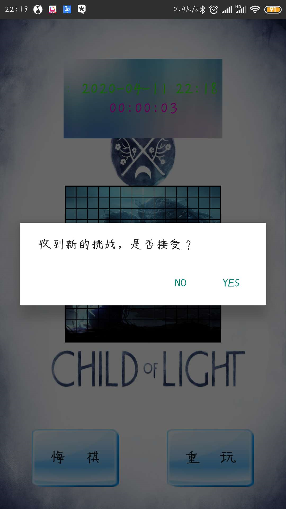

#  Android 五子棋项目实现（通过蓝牙通讯）

## 各功能演示

### 主界面


### 人机


### 本地双人


### 蓝牙连接界面





### 蓝牙对战界面


## 工程配置文件结构


## 五子棋规则

1、对局双方各执一色棋子。

2、空棋盘开局。

3、黑棋虽先行，但有禁手：黑方不能在一步之内形成两个“活三”“活四”或一步之内形成“长连”（指一步形成超过五子连珠）。白方自由，无禁手。

4、棋子下在棋盘的空白点上，棋子下定后，不得向其它点移动，不得从棋盘上拿掉或拿起另落别处。

5、黑方的第一枚棋子可下在棋盘任意交叉点上。

6、轮流下子是双方的权利，但允许任何一方放弃下子权（即：PASS权）

7、获胜的判定：只要黑白方中任意一方的棋子有五子连在一起（即五子连珠），可以为横连、纵连、斜连，则该方获胜，游戏结束。（只要对手形成了“死四”（即一头无己方棋子阻挡），则己方应当采取“防御”措施了。用己方棋子堵住对手“死四”不“死”的一端，保证对手不能形成五子连珠。）


## 脑残人机的算法

这里的简单人机算法是傻瓜式的算法，具体来说就是玩家先下子，然后程序在落子的周围8个点随机选取一个位置落子，

> ```java
> private void naocanautomatic(int x, int y, int Color) {
>     int[][] temp = {{x - 1, y - 1}, {x, y - 1}, {x + 1, y - 1}, {x - 1, y}, {x + 1, y}, {x - 1, y + 1}, {x, y + 1}, {x + 1, y + 1}};
>     ArrayList<int[]> templist = new ArrayList<>();
>     for (int i = 0; i < temp.length; i++) {
>         if (temp[i][0] >= 0 && temp[i][0] < 13 && temp[i][1] >= 0 && temp[i][1] < 13) {
>             templist.add(temp[i]);
>         }
>     }
>     //判断是否已经下过
>     panduanshifouyijingxiaguo(templist);
> 
>     int num = (int) (Math.random() * templist.size());
>     int a = templist.get(num)[0];
>     int b = templist.get(num)[1];
>     putChess(a, b, Color);
> 
> }
> ```

但是有个问题来实现就是这八个点是有可能已经下过的，所有我们保存了每个落子的位置，然后需要有一个函数 panduanshifouyijingxiaguo(templist)来检测是否该位置已经有子了

> ```java
> private void panduanshifouyijingxiaguo(ArrayList<int[]> templist) {
>     for (int i = 0; i < storageHadChess.size(); i++) {
>         for (int j = 0; j < templist.size(); j++) {
>             if (storageHadChess.get(i)[0] == templist.get(j)[0] && storageHadChess.get(i)[1] == templist.get(j)[1]) {
>                 templist.remove(j);//有子时去掉那个位置
>                 //当8个点都已经有子时 递归防止周围没有字落下时直接崩掉
>                 if (templist.size() == 0) {
>                     templist.add(new int[]{(int) (Math.random() * (GRID_SIZE - 2)), (int) (Math.random() * (GRID_SIZE - 2))});
>                     //  Log.d("whalea", " " + (int) (Math.random() * (GRID_SIZE - 2)));
>                     panduanshifouyijingxiaguo(templist);
>                 }
>             }
>         }
>     }
> }
> ```


## 普通人机算法的实现

我们玩五子棋的时候会发现 ，只要连成3点，且两端没有子阻挡住（活三），如果没有实现堵 就会形成“死四”（即一头无己方棋子阻挡），就会输，所以简单（傻瓜）算法的基础上，我们加了一个判断三点成线的条件，也就是说一旦检测到有活三，就让程序往这两端点随机堵一个点，还有就是有当四点成线时像三子时那样堵住第五个子的位置，示例代码如下：

> ```java
>     private void normalautomatic(int x, int y, int Color) {
>         int duishouColor = 0;//对手的颜色
>         //根据我方颜色推测出对手颜色
>         if (Color == 1) {
>             duishouColor = 2;
>         } else {
>             duishouColor = 1;
>         }
>         //判断我方是否有3/4个连成一线了
>         for (int i = 0; i < GRID_SIZE - 1; i++) //i表示列(根据宽度算出来的)
>             for (int j = 0; j < GRID_SIZE - 1; j++) { //i表示行(根据高度算出来的)
>                 //检测横轴三个相连
>                 if ((((i + 3) < (GRID_SIZE - 1)) && (mGridArray[i][j] == Color) && (mGridArray[i + 1][j] == Color) && (mGridArray[i + 2][j] == Color)) || (((i + 3) < (GRID_SIZE - 1)) && (mGridArray[i][j] == duishouColor) && (mGridArray[i + 1][j] == duishouColor) && (mGridArray[i + 2][j] == duishouColor)))
>                 {
>                     //如果有三个点相连了
>                     //先判断是否已经测试过这三个点
>                     boolean aa = false;
>                     for (int p = 0; p < cunchusandianArraylist.size(); p++)
>                     {
>                         String sandiantemp = cunchusandianArraylist.get(p);
>                         String[] sandiantemps = sandiantemp.split(":");
>                         //如果这三个点已经存在
>                         if ((Integer.parseInt(sandiantemps[0]) == i) &&
>                                 (Integer.parseInt(sandiantemps[1]) == j) &&
>                                 (Integer.parseInt(sandiantemps[2]) == (i + 1)) &&
>                                 (Integer.parseInt(sandiantemps[3]) == j) &&
>                                 (Integer.parseInt(sandiantemps[4]) == (i + 2)) &&
>                                 (Integer.parseInt(sandiantemps[5]) == j))
>                         {
>                             aa = true;
>                         }
>                     }
>                     if (aa == true) {
> 
>                     } else
>                         {
>                         //在两边端点位置随机下一个
>                         ifsangedianxianglian(i - 1, j, i + 3, j, Color);
>                         cunchusandianArraylist.add(i + ":" + j + ":" + (i + 1) + ":" + j + ":" + (i + 2) + ":" + j);
>                         return;
>                     }
>                 }
> //                横轴4点!!!!!
>                 if ((((i + 4) < (GRID_SIZE - 1)) && (mGridArray[i][j] == Color) && (mGridArray[i + 1][j] == Color) && (mGridArray[i + 2][j] == Color)&&(mGridArray[i+3][j]==Color)) || (((i + 4) < (GRID_SIZE - 1)) && (mGridArray[i][j] == duishouColor) && (mGridArray[i + 1][j] == duishouColor) && (mGridArray[i + 2][j] == duishouColor)&&(mGridArray[i + 3][j] == duishouColor)))
>                 {
>                     boolean aa=false;
>                     for (int p = 0; p < cunchusidianArraylist.size(); p++)
>                     {
>                         String sidiantemp = cunchusidianArraylist.get(p);
>                         String[] sidiantemps = sidiantemp.split(":");
>                         //如果这四个点已经存在
>                         if ((Integer.parseInt(sidiantemps[0]) == i) &&
>                                 (Integer.parseInt(sidiantemps[1]) == j) &&
>                                 (Integer.parseInt(sidiantemps[2]) == (i + 1)) &&
>                                 (Integer.parseInt(sidiantemps[3]) == j) &&
>                                 (Integer.parseInt(sidiantemps[4]) == (i + 2)) &&
>                                 (Integer.parseInt(sidiantemps[5]) == j)&&
>                                 (Integer.parseInt(sidiantemps[6]) == (i + 3)) &&
>                                 (Integer.parseInt(sidiantemps[7]) == j)
>                         )
>                         {
>                             aa = true;
>                         }
>                     }
>                     if (aa) {
> 
>                     }
>                     else
>                     {
>                         //在两边端点位置随机下一个
>                         ifsangedianxianglian(i - 1, j, i + 3, j, Color);
>                         cunchusidianArraylist.add(i + ":" + j + ":" + (i + 1) + ":" + j + ":" + (i + 2) + ":" + j+":"+(i+3)+":"+j);
>                         return;
>                     }
> 
>                 }
> 
>                 //纵轴3个相连
>                 if ((((j + 3) < (GRID_SIZE - 1)) && (mGridArray[i][j] == Color) && (mGridArray[i][j + 1] == Color) && (mGridArray[i][j + 2] == Color)) || (((j + 3) < (GRID_SIZE - 1)) && (mGridArray[i][j] == duishouColor) && (mGridArray[i][j + 1] == duishouColor) && (mGridArray[i][j + 2] == duishouColor)))
>                 {
>                     //如果有三个点相连了
>                     //先判断是否已经测试过这三个点
>                     boolean aa = false;
>                     for (int p = 0; p < cunchusandianArraylist.size(); p++) {
>                         String sandiantemp = cunchusandianArraylist.get(p);
>                         String[] sandiantemps = sandiantemp.split(":");
>                         if ((Integer.parseInt(sandiantemps[0]) == i) &&
>                                 (Integer.parseInt(sandiantemps[1]) == j) &&
>                                 (Integer.parseInt(sandiantemps[2]) == i) &&
>                                 (Integer.parseInt(sandiantemps[3]) == (j + 1)) &&
>                                 (Integer.parseInt(sandiantemps[4]) == i) &&
>                                 (Integer.parseInt(sandiantemps[5]) == (j + 2)))
>                         {
>                             aa = true;
>                         }
>                     }
>                     if (aa)
>                     {
> 
>                     } else {
>                         //在两边端点位置随机下一个
>                         ifsangedianxianglian(i, j - 1, i, j + 3, Color);
>                         cunchusandianArraylist.add(i + ":" + j + ":" + i + ":" + (j + 1) + ":" + i + ":" + (j + 2));
>                         return;
>                     }
>                 }
> 
>                 //zhong轴4点
>                 if ((((j + 4) < (GRID_SIZE - 1)) && (mGridArray[i][j] == Color) && (mGridArray[i][j + 1] == Color) && (mGridArray[i][j + 2] == Color)&&(mGridArray[i][j + 3] == Color)) || (((j + 3) < (GRID_SIZE - 1)) && (mGridArray[i][j] == duishouColor) && (mGridArray[i][j + 1] == duishouColor) && (mGridArray[i][j + 2] == duishouColor)&& (mGridArray[i][j + 4] == duishouColor)))
>                 {
>                     //如果有4个点相连了
>                     //先判断是否已经测试过这4个点
>                     boolean aa = false;
>                     for (int p = 0; p < cunchusidianArraylist.size(); p++) {
>                         String sidiantemp = cunchusidianArraylist.get(p);
>                         String[] sidiantemps = sidiantemp.split(":");
>                         if ((Integer.parseInt(sidiantemps[0]) == i) &&
>                                 (Integer.parseInt(sidiantemps[1]) == j) &&
>                                 (Integer.parseInt(sidiantemps[2]) == i) &&
>                                 (Integer.parseInt(sidiantemps[3]) == (j + 1)) &&
>                                 (Integer.parseInt(sidiantemps[4]) == i) &&
>                                 (Integer.parseInt(sidiantemps[5]) == (j + 2))&&
>                                 (Integer.parseInt(sidiantemps[6]) == i) &&
>                                 (Integer.parseInt(sidiantemps[7]) == (j + 3))
> 
>                         )
>                         {
>                             aa = true;
>                         }
>                     }
>                     if (aa)
>                     {
> 
>                     } else {
>                         //在两边端点位置随机下一个
>                         ifsangedianxianglian(i, j - 1, i, j + 4, Color);
>                         cunchusidianArraylist.add(i + ":" + j + ":" + i + ":" + (j + 1) + ":" + i + ":" + (j + 2)+ ":" + i + ":" + (j + 3));
>                         return;
>                     }
>                 }
> 
> 
>                 //左上到右下3个相连
>                 if ((((j + 3) < (GRID_SIZE - 1)) && ((i + 3) < (GRID_SIZE - 1)) && (mGridArray[i][j] == Color) && (mGridArray[i + 1][j + 1] == Color) && (mGridArray[i + 2][j + 2] == Color)) || (((j + 3) < (GRID_SIZE - 1)) && ((i + 3) < (GRID_SIZE - 1)) && (mGridArray[i][j] == duishouColor) && (mGridArray[i + 1][j + 1] == duishouColor) && (mGridArray[i + 2][j + 2] == duishouColor)))
>                 {
>                     //如果有三个点相连了
>                     //先判断是否已经测试过这三个点
>                     boolean aa = false;
>                     for (int p = 0; p < cunchusandianArraylist.size(); p++) {
>                         String sandiantemp = cunchusandianArraylist.get(p);
>                         String[] sandiantemps = sandiantemp.split(":");
>                         if ((Integer.parseInt(sandiantemps[0]) == i) &&
>                                 (Integer.parseInt(sandiantemps[1]) == j) &&
>                                 (Integer.parseInt(sandiantemps[2]) == (i + 1)) &&
>                                 (Integer.parseInt(sandiantemps[3]) == (j + 1)) &&
>                                 (Integer.parseInt(sandiantemps[4]) == (i + 2)) &&
>                                 (Integer.parseInt(sandiantemps[5]) == (j + 2))) {
>                             aa = true;
>                         }
>                     }
>                     if (aa) {
> 
>                     } else {
>                         ifsangedianxianglian(i - 1, j - 1, i + 3, j + 3, Color);
>                         cunchusandianArraylist.add(i + ":" + j + ":" + (i + 1) + ":" + (j + 1) + ":" + (i + 2) + ":" + (j + 2));
>                         return;
>                     }
>                 }
> 
>                 //左上到右下4个相连
>                 if ((((j + 4) < (GRID_SIZE - 1)) && ((i + 4) < (GRID_SIZE - 1)) && (mGridArray[i][j] == Color) && (mGridArray[i + 1][j + 1] == Color) && (mGridArray[i + 2][j + 2] == Color)&& (mGridArray[i + 3][j + 3] == Color)) || (((j + 4) < (GRID_SIZE - 1)) && ((i + 4) < (GRID_SIZE - 1)) && (mGridArray[i][j] == duishouColor) && (mGridArray[i + 1][j + 1] == duishouColor) && (mGridArray[i + 2][j + 2] == duishouColor)&& (mGridArray[i + 3][j + 3] == duishouColor)))
>                 {
>                     //如果有三个点相连了
>                     //先判断是否已经测试过这三个点
>                     boolean aa = false;
>                     for (int p = 0; p < cunchusidianArraylist.size(); p++) {
>                         String sidiantemp = cunchusidianArraylist.get(p);
>                         String[] sidiantemps = sidiantemp.split(":");
>                         if ((Integer.parseInt(sidiantemps[0]) == i) &&
>                                 (Integer.parseInt(sidiantemps[1]) == j) &&
>                                 (Integer.parseInt(sidiantemps[2]) == (i + 1)) &&
>                                 (Integer.parseInt(sidiantemps[3]) == (j + 1)) &&
>                                 (Integer.parseInt(sidiantemps[4]) == (i + 2)) &&
>                                 (Integer.parseInt(sidiantemps[5]) == (j + 2))&&
>                                 (Integer.parseInt(sidiantemps[6]) == (i + 3)) &&
>                                 (Integer.parseInt(sidiantemps[7]) == (j + 3))
> 
> 
>                         )
>                         {
>                             aa = true;
>                         }
>                     }
>                     if (aa) {
> 
>                     } else {
>                         ifsangedianxianglian(i - 1, j - 1, i + 4, j + 4, Color);
>                         cunchusidianArraylist.add(i + ":" + j + ":" + (i + 1) + ":" + (j + 1) + ":" + (i + 2) + ":" + (j + 2)+ ":" + (i + 3) + ":" + (j + 3));
>                         return;
>                     }
>                 }
> 
> 
>                 //右上到左下3个相连
>                 if ((((i - 3) >= 0) && ((j + 3) < (GRID_SIZE - 1)) && (mGridArray[i][j] == Color) && (mGridArray[i - 1][j + 1] == Color) && (mGridArray[i - 2][j + 2] == Color)) || (((i - 3) >= 0) && ((j + 3) < (GRID_SIZE - 1)) && (mGridArray[i][j] == duishouColor) && (mGridArray[i - 1][j + 1] == duishouColor) && (mGridArray[i - 2][j + 2] == duishouColor)))
>                 {
>                     //如果有三个点相连了
>                     //先判断是否已经测试过这三个点
>                     boolean aa = false;
>                     for (int p = 0; p < cunchusandianArraylist.size(); p++) {
>                         String sandiantemp = cunchusandianArraylist.get(p);
>                         String[] sandiantemps = sandiantemp.split(":");
>                         if ((Integer.parseInt(sandiantemps[0]) == i) &&
>                                 (Integer.parseInt(sandiantemps[1]) == j) &&
>                                 (Integer.parseInt(sandiantemps[2]) == (i - 1)) &&
>                                 (Integer.parseInt(sandiantemps[3]) == (j + 1)) &&
>                                 (Integer.parseInt(sandiantemps[4]) == (i - 2)) &&
>                                 (Integer.parseInt(sandiantemps[5]) == (j + 2))) {
>                             aa = true;
>                         }
>                     }
>                     if (aa == true) {
> 
>                     } else {
>                         ifsangedianxianglian(i + 1, j - 1, i - 3, j + 3, Color);
>                         cunchusandianArraylist.add(i + ":" + j + ":" + (i - 1) + ":" + j + 1 + ":" + (i - 2) + ":" + (j + 2));
>                         return;
>                     }
>                 }
> 
>                 //右上到左下4个相连
>                 if ((((i - 4) >= 0) && ((j + 4) < (GRID_SIZE - 1)) && (mGridArray[i][j] == Color) && (mGridArray[i - 1][j + 1] == Color) && (mGridArray[i - 2][j + 2] == Color)&& (mGridArray[i - 3][j + 3] == Color)) || (((i - 4) >= 0) && ((j + 4) < (GRID_SIZE - 1)) && (mGridArray[i][j] == duishouColor) && (mGridArray[i - 1][j + 1] == duishouColor) && (mGridArray[i - 2][j + 2] == duishouColor)&& (mGridArray[i - 3][j + 3] == duishouColor)))
>                 {
>                     //如果有三个点相连了
>                     //先判断是否已经测试过这三个点
>                     boolean aa = false;
>                     for (int p = 0; p < cunchusidianArraylist.size(); p++) {
>                         String sidiantemp = cunchusidianArraylist.get(p);
>                         String[] sidiantemps = sidiantemp.split(":");
>                         if ((Integer.parseInt(sidiantemps[0]) == i) &&
>                                 (Integer.parseInt(sidiantemps[1]) == j) &&
>                                 (Integer.parseInt(sidiantemps[2]) == (i - 1)) &&
>                                 (Integer.parseInt(sidiantemps[3]) == (j + 1)) &&
>                                 (Integer.parseInt(sidiantemps[4]) == (i - 2)) &&
>                                 (Integer.parseInt(sidiantemps[5]) == (j + 2))&&
>                                 (Integer.parseInt(sidiantemps[6]) == (i - 3)) &&
>                                 (Integer.parseInt(sidiantemps[7]) == (j + 3))
>                         )
> 
>                         {
>                             aa = true;
>                         }
>                     }
>                     if (aa) {
> 
>                     } else {
>                         ifsangedianxianglian(i + 1, j - 1, i - 4, j + 4, Color);
>                         cunchusidianArraylist.add(i + ":" + j + ":" + (i - 1) + ":" + (j + 1) + ":" + (i - 2) + ":" + (j + 2)+ ":" + (i - 3) + ":" + (j + 3));
>                         return;
>                     }
>                 }
>                 //buxing  ye kuaitule
> 
> 
> 
> 
>             }
>         int[][] temp = {{x - 1, y - 1}, {x, y - 1}, {x + 1, y - 1}, {x - 1, y}, {x + 1, y}, {x - 1, y + 1}, {x, y + 1}, {x + 1, y + 1}};//周围八个点
>         ArrayList<int[]> templist = new ArrayList<>();
>         for (int k = 0; k < temp.length; k++) {
>             if (temp[k][0] >= 0 && temp[k][0] < 13 && temp[k][1] >= 0 && temp[k][1] < 13) {
>                 templist.add(temp[k]);
>             }
>             //判断是否已经下过
>             panduanshifouyijingxiaguo(templist);
>             int num = (int) (Math.random() * templist.size());
>             int a = templist.get(num)[0];
>             int b = templist.get(num)[1];
>             putChess(a, b, Color);
>             return;
>         }
>     }
> 
> ```

最后一个检测胜利的函数，遍历所有的点，检测所有能连成五子的方式（x轴五子，y轴五子，斜轴五子），存在就返回true。


## 蓝牙对战系统的实现

### 一次socket通讯流程


​		1.服务器根据地址类型（ipv4、ipv6）、socket类型、协议创建socket

　　服务器为socket绑定对应的IP地址和端口号

　　服务器监听端口号请求，接收用户发来的连接请求，此时服务器没有打开socket

------

·　　2.用户创建socket

　　 用户打开socket，并通过IP地址+端口号试图connect服务器的socket

------

　　3.服务器接收到了用户发来的socket连接请求，被动打开socket，开始接收客户端请求，直				到			  用户返回连接信息。这时候服务器的socket进入堵塞状态，所谓堵塞，即					accept();方法，一 直接收到客户端返回连接信息后才返回，然后开始接收下一个用				户端请求

------

　　4.客户端连接成功，开始向服务器输入状态信息

------

　　5.服务器accept();方法返回，连接成功

------

　　6.客户端写入信息

------

　　7.服务器读取信息

　　客户端关闭

------

　　8.服务端关闭

### 蓝牙连接通讯技术


#### 蓝牙API(可以看，但没必要，建议不看)

Android所有关于蓝牙开发的类都在android.bluetooth包下，只有8个类:

BluetoothAdapter     本地蓝牙适配器 
	BluetoothClass      蓝牙类（主要包括服务和设备） 
	BluetoothClass.Device    蓝牙设备类 
	BluetoothClass.Device.Major    蓝牙设备管理 
	BluetoothClass.Service   蓝牙服务类 
	BluetoothDevice     蓝牙设备（远程蓝牙设备） 
	BluetoothServiceSocket    监听蓝牙连接的类 
	BluetoothSocket     蓝牙连接类

1、BluetoothAdapter ：
表示本地的蓝牙适配器 （蓝牙射频）。BluetoothAdapter 是为所有蓝牙交互的入口点。它可以发现其他蓝牙设备、 查询绑定 (配对) 设备的列表、 实例化已知的 MAC 地址的BluetoothDevice（蓝牙设备） 和创建 BluetoothServerSocket 用于侦听来自其他设备的通信。直到我们建立bluetoothSocket连接之前，都要不断操作它 

2、BluetoothDevice
	表示远程蓝牙设备。使用此类并通过BluetoothSocket类可以请求连接远程设备，或查询这台设备的信息如其名称、 地址、 类和绑定状态。
createRfcommSocketToServiceRecord(UUIDuuid)
根据UUID创建并返回一个BluetoothSocket,这个方法也是我们获取BluetoothDevice的目的——创建BluetoothSocket。这个类其他的方法，如getAddress()、getName()，同BluetoothAdapter。

3、BluetoothServerSocket
表示打开服务器套接字侦听传入的请求 （类似于 TCP ServerSocket）。为了连接两台 Android 设备，一台设备必须用此类打开一个服务器套接字。当远程蓝牙设备向此设备发出连接请求时，而且当连接被接收时，BluetoothServerSocket 将返回连接的 BluetoothSocket

**4、BluetoothSocket**
**跟BluetoothServerSocket相对，是客户端。表示一个蓝牙套接字 （类似于 TCP Socket） 的接口。这是一个允许应用程序与另一台蓝牙设备通过InputStream和OutputStream来交换数据的连接点。其一共5个方法，一般都会用到。**

```
close()：关闭
connect()：连接
getInptuStream()：获取输入流
getOutputStream()：获取输出流
getRemoteDevice()：获取远程设备，这里指的是获取bluetoothSocket指定连接的那个远程蓝牙设备
```

5、BluetoothClass
描述的一般特征和蓝牙设备的功能。这是一整套只读的属性用于定义设备的主要和次要设备类和它的服务。然而，这并不是支持所有蓝牙配置文件和服务的设备，但很适用于获取设备类型

6、BluetoothProfile
表示一个蓝牙配置文件。蓝牙配置文件是基于蓝牙通信设备之间的无线接口规范。如免提规范(Hands-Free profile)

7、BluetoothHeadset
蓝牙耳机与手机一起使用配置文件 ,这包括蓝牙耳机和免提（v1.5） 的配置文件

8、BluetoothA2dp
定义了如何高质量的音频可以进行流式处理从一个设备到另一个通过蓝牙连接。”A2DP”代表先进音频分配协议

9、BluetoothHealth
表示控制蓝牙服务健康设备协议

10、BluetoothHealthCallback
BluetoothHealthCallback 一个抽象类，您使用来实现 BluetoothHealth 回调，你必须扩展此类并实现回调方法以接收有关更改的更新应用程序的注册和蓝牙通道状态。BluetoothHealthAppConfiguration 表示一个蓝牙健康第三方应用程序注册与远程蓝牙健康设备进行通信的应用程

11、BluetoothHealthAppConfiguration
表示一个蓝牙健康第三方应用程序注册与远程蓝牙健康设备进行通信的应用程序配置

12、BluetoothProfile.ServiceListener
通知 BluetoothProfile IPC 客户端界面时已被连接或断开服务 （即运行一个特定的配置文件内部服务）


#### **<u>android中使用蓝牙要用到的主要权限</u>**

> ```java
> <uses-permission android:name="android.permission.BLUETOOTH"/>
> <uses-permission android:name="android.permission.BLUETOOTH_ADMIN"/>
> ```
>
> 

### 使用蓝牙模块

#### 扫描模块


```java
private class BluetoothReceiver extends BroadcastReceiver {
    public void onReceive(Context context, Intent intent) {
        String action = intent.getAction();
        if (BluetoothDevice.ACTION_FOUND.equals(action)) //如果是正在扫描状态
        {
            //只要BluetoothReceiver接收到来自于系统的广播,这个广播是什么呢,是我找到了一个远程蓝牙设备
            //Intent代表刚刚发现远程蓝牙设备适配器的对象,可以从收到的Intent对象取出一些信息
            BluetoothDevice bluetoothDevice = intent.getParcelableExtra(BluetoothDevice.EXTRA_DEVICE);
            // 如果该设备已经被配对，则跳过
            //  if (bluetoothDevice.getBondState() != BluetoothDevice.BOND_BONDED) {
            if (!devices.contains(bluetoothDevice)) {
                //设备数组获得新的设备信息并更新adapter
                deviceNameAndDresss.add(new Device(bluetoothDevice.getName(), bluetoothDevice.getAddress(),bluetoothDevice.getBondState()));
                //添加新的设备到设备Arraylist
                devices.add(bluetoothDevice);
                deviceshowAdapter.notifyDataSetChanged();
            }

        }
    }
}
```

也可以直接调用BlueToothAapter的startDiscovery()方法主动进行扫描：

> ```java
>  //扫描周围的蓝牙设备按钮监听器
> private class SaoMiaoButtonListener implements View.OnClickListener {
> 
>     @Override
>     public void onClick(View v) {
>         ObjectAnimator animator = ObjectAnimator.ofFloat(v,"rotation",0,359);
>         animator.setRepeatCount(12);
>         animator.setDuration(1000);
>         animator.start();
> 
> isQuering = true;
>         Toast.makeText(BlueToothFindOthersAty.this, "开始扫描", Toast.LENGTH_SHORT).show();
>         //清空列表
>         deviceNameAndDresss.clear();
>         //获得已配对过的蓝牙设备
>         Set<BluetoothDevice> pairedDevices = bluetoothAdapter.getBondedDevices();
>         if (pairedDevices.size() > 0) {
>             for (BluetoothDevice device : pairedDevices) {
>                 if (!devices.contains(device)) {
>                     deviceNameAndDresss.add(new Device(device.getName(), device.getAddress(),device.getBondState()));
>                     devices.add(device);
>                 }
>             }
>         }
>         deviceshowAdapter.setDevices(deviceNameAndDresss);
>         deviceshowAdapter.notifyDataSetChanged();
>         //开始扫描周围的可见的蓝牙设备
>         bluetoothAdapter.startDiscovery();//开始
> 
>     }
> }
> 
> ```
>
> 


#### 客户端主动连接线程

首先判断与这个device是否进行过配对，如果没有，就进行配对，如果已经进行过配对，就发送联机对战的请求，然后连接，然后跳转到BlueToothGameAty进行蓝牙对战。

```java
    private void buildConnect(int position, boolean isfaqiren) {
        //自己主动去连接
        BluetoothDevice device = bluetoothAdapter.getRemoteDevice(deviceNameAndDresss.get(position).getDeviceAddress());
        Boolean result = false;
        try {
            //先进行配对
            //如果没有配对
            Log.d("whalea", "开始配对");
            if (device.getBondState() == BluetoothDevice.BOND_NONE) {
                Method createBondMethod = null;
                createBondMethod = BluetoothDevice.class
                        .getMethod("createBond");

                Log.d("whalea", "开始配对");
                result = (Boolean) createBondMethod.invoke(device);
            }
            //如果已经配对好了
            else if (device.getBondState() == BluetoothDevice.BOND_BONDED) {
                //获得客户端Socket
                kehuduanSocket = device.createRfcommSocketToServiceRecord(Config.UUID);
                final AlertDialog aDialog = new AlertDialog.Builder(BlueToothFindOthersAty.this).
                        setTitle("发起对战").
                        setMessage("确认挑战玩家：" + deviceNameAndDresss.get(position).getDeviceName() + "吗？")
                        .setNegativeButton("确定", new DialogInterface.OnClickListener() {
                            @Override
                            public void onClick(DialogInterface dialog, int which) {
                                new Thread(new Runnable() {
                                    @Override
                                    public void run() {
                                        //先停止扫描，以防止之后的连接被阻塞
                                        bluetoothAdapter.cancelDiscovery();
                                        try {
                                            //开始连接，发送连接请求
                                            kehuduanSocket.connect();
                                            if (!bluetoothAdapter.isEnabled()) {
                                                bluetoothAdapter.enable();
                                            }
                                            if (kehuduanSocket.isConnected()) {
                                                runOnUiThread(new Runnable() {
                                                    @Override
                                                    public void run() {
                                                        Toast.makeText(BlueToothFindOthersAty.this, "连接成功！！", Toast.LENGTH_SHORT).show();
                                                        //执行socket方法
                                                         BlueToothGameAty blueToothGameAty = new BlueToothGameAty();

                                                        blueToothGameAty.blueToothGameAty.manageConnectedSocket(kehuduanSocket, true);
                                                     //   blueToothGameAty.blueToothGameAty.chushihua(blueToothGameAty);
                                                    }
                                                });
                                                //跳转到蓝牙游戏activity
                                                Intent i = new Intent(BlueToothFindOthersAty.this,BlueToothGameAty.class);
                                                startActivity(i);
                                            }
                                        } catch (final IOException e) {
                                            runOnUiThread(new Runnable() {
                                                @Override
                                                public void run() {
                                                    Toast.makeText(BlueToothFindOthersAty.this, "连接失败！！" + e.getMessage(), Toast.LENGTH_SHORT).show();

                                                }
                                            });
                                                 /*   try {
                                                        kehuduanSocket.close();
                                                    } catch (IOException e1) {
                                                    }
                                                    return;*/
                                        }
                                        // manageConnectedSocket(kehuduanSocket);
                                        //之后关闭socket，清除内部资源
                                          /*      try {
                                                    kehuduanSocket.close();
                                                } catch (IOException e) {
                                                    e.printStackTrace();
                                                }*/
                                    }
                                }).start();
                            }
                        })
                        .setPositiveButton("取消", null).show();
            }
        } catch (Exception e) {
            e.printStackTrace();
        }
    }
```


#### 服务端的被动监听连接实现

服务端需要做的就是监听上面的主动连接程序的请求，回应是进行配对，还是进行连接对战

首先new一个线程然后通过accept()函数一直监听就可以了。然后如果接收配对就配对，对战就跳转到蓝牙对战的activity

```java
bluetoothServerSocket = 			bluetoothAdapter.listenUsingInsecureRfcommWithServiceRecord(benjiname, Config.UUID);
fuwuSocket = bluetoothServerSocket.accept();
```


> ```java
> new Thread(new Runnable() {
>     @Override
>     public void run() {
>         try {
>             //开启服务端
>             //等待客户端接入
>             while (true) {
>                 bluetoothServerSocket = bluetoothAdapter.listenUsingInsecureRfcommWithServiceRecord(benjiname, Config.UUID);
>                 fuwuSocket = bluetoothServerSocket.accept();
>                 if (fuwuSocket.isConnected()) {
> 
> 
>                     runOnUiThread(new Runnable() {
>                         @Override
>                         public void run() {
>                             Toast.makeText(BlueToothFindOthersAty.this, "接收挑战请求，建立连接成功！nmsl", Toast.LENGTH_SHORT);
>                             //执行socket方法
> 
>                              BlueToothGameAty blueToothGameAty = new BlueToothGameAty();
>                             blueToothGameAty.blueToothGameAty.manageConnectedSocket(fuwuSocket, false);
>                      //       blueToothGameAty.blueToothGameAty.chushihua(blueToothGameAty);
>                         }
>                     });
> 
> 
>                     //跳转到蓝牙游戏activity
>                     Intent i = new Intent(BlueToothFindOthersAty.this,BlueToothGameAty.class);
>                     startActivity(i);
>                     //初始化线程来传输数据
>                     // manageConnectedSocket(fuwuSocket);
>                     //得到连接之后关闭ServerSocket
>                     // bluetoothServerSocket.close();
>                     //打断线程
>                     //   Thread.interrupted();
>                 }
>             }
>         } catch (IOException e) {
>             e.printStackTrace();
>             Log.d("whalea", "没读到的原因！：" + e.getMessage());
>         }
>     }
> }).start();
> ```


### 蓝牙对战时的通讯逻辑实现


基于上面的蓝牙连接  我们已经可以与另一台进行通讯，通过BluetoothSocket类可以获取到字节流，

```java
            try {
                tmpIn = socket.getInputStream();
                tmpOut = socket.getOutputStream();
            } catch (IOException e) {
            }

            mmInStream = tmpIn;
            mmOutStream = tmpOut;
```

然后依据得到的字节流，转化为我们的具体命令，（如果是拒绝接受挑战，就会把通讯线程关闭，并回到主界面）

```java
DataInputStream datains = new DataInputStream(mmInStream);
                String command = null;
                try {
                    command = datains.readUTF();

                } catch (IOException e) {
                    e.printStackTrace();
                }
                final String finalCommand = command;
```

，如果是下棋的信息，我们就把消息通过BlueToothGobangView类传递给对战逻辑，

```java
private static BlueToothGoBangView gbv;


gbv.xiaqi(finalCommand);
```

收到消息后,对消息做出处理

```java
public void xiaqi(String command) {
    if ((command==null)) {
        return;
    }
    if ((command.equals("HUIQI"))) //悔棋
    {
        if (storageArray.size()==0) {
            Toast.makeText(getContext(),"开局并不能悔棋",Toast.LENGTH_SHORT).show();
        }
        else {
            if (storageArray.size()==1) {
                storageArray.pop();
                mGridArray = new int[GRID_SIZE - 1][GRID_SIZE - 1];
                invalidate();
            } else {
                String temp = storageArray.pop();
                String[] temps = temp.split(":");

                int a = Integer.parseInt(temps[0]);
                int b = Integer.parseInt(temps[1]);
                mGridArray[a][b] = 0;
                invalidate();
            }
        }
    }
    else if ((command.equals("REFRESH")))//刷新
    {
        setVisibility(View.VISIBLE);
        mStatusTextView.invalidate();
        init();
        invalidate();
        for (int i = 0; i < showtime.length; i++) {
            showtime[i] = 0;
        }
        SimpleDateFormat simpleDateFormat = new SimpleDateFormat("yyyy-MM-dd HH:mm:ss:SSS");
        mStatusTextView.setText("蓝牙对战模式 当前时间：" + simpleDateFormat.format(new Date()));
    }
    else if ((command.equals("WHITE"))) {
        mStatusTextView.setText("白棋赢辣");
    }
    else if (command.equals("BLACK")) {
        mStatusTextView.setText("黑棋赢辣");
    }
    else {
        Log.d("whalea", "收到的指令:" + command);
        String[] temps = command.split(":");//分割
        int a = Integer.parseInt(temps[0]);
        int b = Integer.parseInt(temps[1]);
        int c = Integer.parseInt(temps[2]);
        mGridArray[a][b] = c;
        //  wbflag = c;//该下白棋了=2，该下黑棋了=1. 这里先下黑棋（黑棋以后设置为机器自动下的棋子）
        if (wbflag == 1) {
            wbflag = 2;
        }
        else {
            wbflag = 1;
        }
        String temp = a + ":" + b;
        storageArray.push(temp);//将每一步存到数组中，方便进行悔棋操作
    }
    invalidate();//重绘
}
```

通讯解决了，与人机对战一样，需要一个checkwin函数来判定胜负，判断的标准还是遍历棋盘，检查三种五子连成一体的情况，并返回时黑子还是白子，然后又回到上述的信息通讯，双方对消息进行处理，在textview上显示胜方


# 参考文档

https://www.cnblogs.com/Bw98blogs/p/7525543.html

https://blog.csdn.net/qq_34317125/article/details/79849387

https://blog.csdn.net/a1533588867/article/details/52460636

https://blog.csdn.net/qq_22770457/article/details/51622094

https://blog.csdn.net/a1533588867/article/details/52459996

https://blog.csdn.net/a1533588867/article/details/52459996


